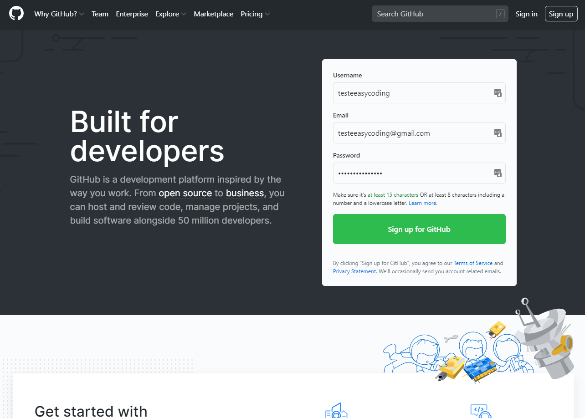
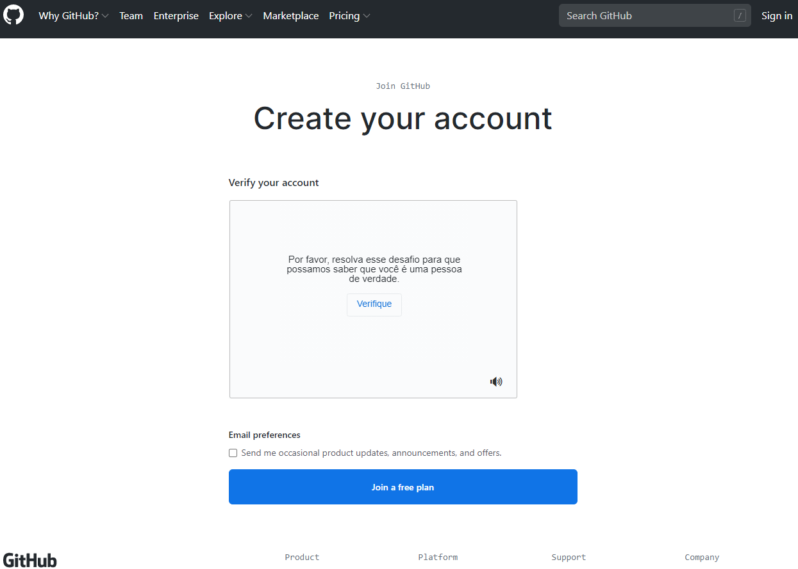
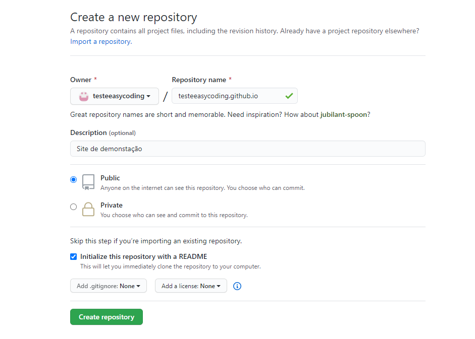
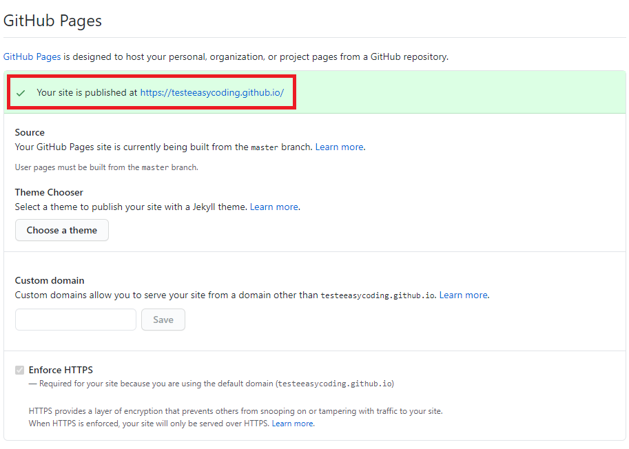

Nesse post, vamos começar com as ferramentas necessárias para podermos criar nosso site

Para criar e publicar nosso site, precisamos de 3 coisas: um editor de texto, um hospedeiro pro nosso site, e um programa para integrar os dois.

<!--more-->

Como editor, usaremos o Visual Studio Code, pois além de ser um dos editores mais usados por progamadores no mundo, ele também tem uma interface fácil de entender. Baixe ele [aqui](https://code.visualstudio.com/), mas ainda não execute.

Para a hospedagem, usaremos o GitHub, uma das maiores plataformas de hospedagem de repositórios de código. Crie sua conta [aqui](https://github.com/) (siga o passo-a-passo abaixo).

E para integrar os dois, usamos o Git. Baixe ele [aqui](https://www.git-scm.com/), idem.

## GitHub

### Criando a conta

Primeiro, preencha seu nome de usuário, email e senha:

Agora verifique sua conta e clique no botão azul:

Agora confira no seu email se recebeu a verificação e confirme:

### Criando o repositório

Depois de verificar, vamos criar nosso repositório (é onde o código do nosso site será armazenado):

Em **Respository name**, colocamos o nome do nosso site + *github.io*;

Caso queira, coloque uma descrição;

Deixe como público;

E cheque a caixa de inicializar com um **leia-me**:

Agora, para descobrir o link do nosso site, vamos em **settings** e rolamos até **GitHub Pages**. Lá estará escrito o endereço:

Pronto! Já temos o local para o nosso site reservado, agora vamos para o Visual Studio Code para ver onde o site será feito de fato.

## Visual Studio Code